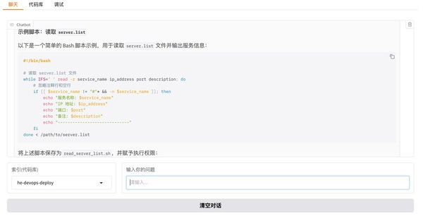

## 项目简介

Talk to Code 是一款小工具，旨在让你通过自然语言与代码库进行交互。

**效果图:**



## 原理

**1.下载代码仓库**: Talk to Code 通过 Gitlab API 下载代码仓库到本地。

**2.代码库切片**: 将代码库文件切片成小的内容片段。

**3.向量生成**: 将切片生成向量，存入向量数据库。

**4.问答**: 接收用户的自然语言问句，通过向量相似度算法找到最相似内容，提交给大模型进行生成答案。

## 部署

**1. 获取源码**

```bash
git clone https://github.com/sunmh207/talk-to-code.git
cd talk-to-code
```

**2. 安装依赖**

建议使用 Python 3.10+ 版本，并创建虚拟环境：

```bash
pip install -r requirements.txt
```

**3. 配置环境变量**


1. 复制 .env.dist 为 .env

2. 根据实际情况修改配置

```bash
#Gitlab Settings
GITLAB_BASE_URL={your_gitlab_base_url}
GITLAB_ACCESS_TOKEN={your_gitlab_access_token}

#Local Storage Settings
LOCAL_REPOS_DIR=data/repos

#Vector Storage Settings
MARQO_BASE_URL=http://localhost:8882

#Chunk Settings
TOKENS_PER_CHUNK=800

#LLM Settings
LLM_PROVIDER=deepseek
DEEPSEEK_API_KEY={your_deepseek_api_key}
DEEPSEEK_API_MODEL=deepseek-chat
```

### 4. 启动服务

**启动向量数据库服务**

```bash
docker compose up -d
```

**创建项目索引**

```bash
python index.py 
```

按照提示输入相关信息以创建索引。

**启动Chatbot服务**

```bash
python chat.py
```

启动后，在浏览器中访问 http://127.0.0.1:7860 即可开始使用。

## 交流

若本项目对您有帮助，欢迎 Star ⭐️ 或 Fork。 有任何问题或建议，欢迎提交 Issue 或 PR。